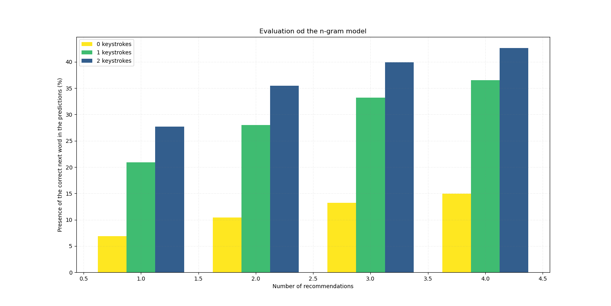

<!-- Improved compatibility of back to top link: See: https://github.com/othneildrew/Best-README-Template/pull/73 -->
<a name="readme-top"></a>


<!-- PROJECT SHIELDS -->
<!--
*** I'm using markdown "reference style" links for readability.
*** Reference links are enclosed in brackets [ ] instead of parentheses ( ).
*** See the bottom of this document for the declaration of the reference variables
*** for contributors-url, forks-url, etc. This is an optional, concise syntax you may use.
*** https://www.markdownguide.org/basic-syntax/#reference-style-links

[![Contributors][contributors-shield]][contributors-url]
[![Forks][forks-shield]][forks-url]
[![Stargazers][stars-shield]][stars-url]
[![Issues][issues-shield]][issues-url]
[![MIT License][license-shield]][license-url]
[![LinkedIn][linkedin-shield]][linkedin-url]
-->


<!-- PROJECT LOGO -->
<br />
<div align="center">

<h3 align="center">Next Word Predictor</h3>

  <p align="center">
    Web Interface for trying out n-gram and neural language models to predict the next words a user types.
    <br />
    <a href="https://github.com/simondoebele/next-word-predictor"><strong>Explore the docs »</strong></a>
    <br />
    <br />
    <a href="https://github.com/simondoebele/next-word-predictor/issues">Report Bug</a>
    ·
    <a href="https://github.com/simondoebele/next-word-predictor/issues">Request Feature</a>
  </p>
</div>


In the web interface, we can choose between our two different types of language models (n-gram or neural), we can type something, for which we want to see predictions, we can choose how many different words we receive as suggestions, and we can click on a suggestions so to not needing to type it.


<!-- TABLE OF CONTENTS -->
<details>
  <summary>Table of Contents</summary>
  <ol>
    <li>
      <a href="#about-the-project">About The Project</a>
    </li>
    <li>
      <a href="#getting-started">Getting Started</a>
      <ul>
        <li><a href="#prerequisites">Prerequisites</a></li>
        <li><a href="#usage">Usage</a></li>
        <li><a href="#structure">Repository Structure</a></li>
      </ul>
    </li>
    <li><a href="#contributing">Contributing</a></li>
    <!-- <li><a href="#acknowledgments">Acknowledgments</a></li> -->
  </ol>
</details>


<!-- ABOUT THE PROJECT -->
## About The Project

In this project, we built a web interface with Dash to showcase the results of our two competing language models (one based on n-grams, the other based on RNNs). This was the final project, we proposed for the graduate course [Language Engineering](https://www.kth.se/student/kurser/kurs/DD2417?l=en) at the Royal Institute of Technology, Stockholm. The overarching purpose of the project was to improve typing speed of smartphone users using language technologies.


The presentation and article ("report") go into much more detail regarding the training setup and parameters used. As a result, we found that the n-gram performs better than the RNN (given our setup, although better data and some more hyperparameter tuning could have given the RNN the edge). We show that increasing the dataset improves the performance. But we need to be careful with overfitting. Then again, in a user setting, overfitting on user data might be a bug, not a feature.




<p align="right">(<a href="#readme-top">back to top</a>)</p>


<!-- GETTING STARTED -->
## Getting Started

### Prerequisites

```
pip install -r requirements.txt
```


<!-- USAGE EXAMPLES -->
### Usage

To run the Dash web application, simply run the `app.py` file as follows:

```
python app.py
```

Then, go to your browser and type `127.0.0.1:8050` to access the app. You can then start writing in the text area and words are going to be suggested to you in the console. If you click on one of them, it will automatically add the word at the end of your text.

<p align="right">(<a href="#readme-top">back to top</a>)</p>


<!-- Repository Structure -->
### Repository structure

- app.py: the Dash app
- app_components: the Dash app components (main page, navigation bar, and the two different language models (LMs) - n-gram and neural LMs)
- models: here, we show how we compute the n-grams and the RNN models as well as how we evaluate them.
- processed_n_grams: we store our n-gram computations here
- data: the data we used for training our models
- evaluation: results of evaluating the LMs
- config.py: some starting configuration for certain parameters for the app


<p align="right">(<a href="#readme-top">back to top</a>)</p>


<!-- CONTRIBUTING -->
## Contributing

If you have a suggestion that would make this better, please fork the repo and create a pull request. You can also simply open an issue with the tag "enhancement".
Don't forget to give the project a star! Thanks again!

1. Fork the Project
2. Create your Feature Branch (`git checkout -b feature/AmazingFeature`)
3. Commit your Changes (`git commit -m 'Add some AmazingFeature'`)
4. Push to the Branch (`git push origin feature/AmazingFeature`)
5. Open a Pull Request

<p align="right">(<a href="#readme-top">back to top</a>)</p>


<!-- ACKNOWLEDGMENTS 
## Acknowledgments

* []() https://github.com/othneildrew/Best-README-Template/
* []()
* []()


<p align="right">(<a href="#readme-top">back to top</a>)</p>
-->


<!-- MARKDOWN LINKS & IMAGES -->
<!-- https://www.markdownguide.org/basic-syntax/#reference-style-links -->
[contributors-shield]: https://img.shields.io/github/contributors/github_username/repo_name.svg?style=for-the-badge
[contributors-url]: https://github.com/github_username/repo_name/graphs/contributors
[forks-shield]: https://img.shields.io/github/forks/github_username/repo_name.svg?style=for-the-badge
[forks-url]: https://github.com/github_username/repo_name/network/members
[stars-shield]: https://img.shields.io/github/stars/github_username/repo_name.svg?style=for-the-badge
[stars-url]: https://github.com/github_username/repo_name/stargazers
[issues-shield]: https://img.shields.io/github/issues/github_username/repo_name.svg?style=for-the-badge
[issues-url]: https://github.com/github_username/repo_name/issues
[license-shield]: https://img.shields.io/github/license/github_username/repo_name.svg?style=for-the-badge
[license-url]: https://github.com/github_username/repo_name/blob/master/LICENSE.txt
[linkedin-shield]: https://img.shields.io/badge/-LinkedIn-black.svg?style=for-the-badge&logo=linkedin&colorB=555
[linkedin-url]: https://linkedin.com/in/linkedin_username
[product-screenshot]: images/screenshot.png
[Next.js]: https://img.shields.io/badge/next.js-000000?style=for-the-badge&logo=nextdotjs&logoColor=white
[Next-url]: https://nextjs.org/
[React.js]: https://img.shields.io/badge/React-20232A?style=for-the-badge&logo=react&logoColor=61DAFB
[React-url]: https://reactjs.org/
[Vue.js]: https://img.shields.io/badge/Vue.js-35495E?style=for-the-badge&logo=vuedotjs&logoColor=4FC08D
[Vue-url]: https://vuejs.org/
[Angular.io]: https://img.shields.io/badge/Angular-DD0031?style=for-the-badge&logo=angular&logoColor=white
[Angular-url]: https://angular.io/
[Svelte.dev]: https://img.shields.io/badge/Svelte-4A4A55?style=for-the-badge&logo=svelte&logoColor=FF3E00
[Svelte-url]: https://svelte.dev/
[Laravel.com]: https://img.shields.io/badge/Laravel-FF2D20?style=for-the-badge&logo=laravel&logoColor=white
[Laravel-url]: https://laravel.com
[Bootstrap.com]: https://img.shields.io/badge/Bootstrap-563D7C?style=for-the-badge&logo=bootstrap&logoColor=white
[Bootstrap-url]: https://getbootstrap.com
[JQuery.com]: https://img.shields.io/badge/jQuery-0769AD?style=for-the-badge&logo=jquery&logoColor=white
[JQuery-url]: https://jquery.com 
